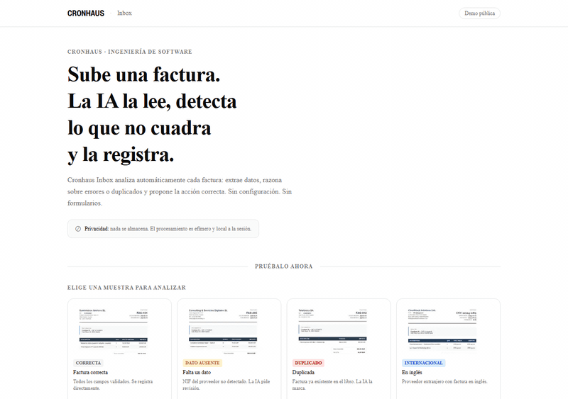

# Cronhaus Inbox

**Agente de lectura y registro de facturas con IA.**  
Sube una factura. La IA la lee, razona sobre huecos, duplicados e inconsistencias, y la registra en el libro de gastos — sin formularios, sin configuración.



> Capturas estáticas: [home](docs/demo-1-home.png) · [duplicada detectada](docs/demo-3-duplicada-findings.png) · [ledger](docs/demo-6-ledger-final.png)

---

## El problema

Revisar y registrar facturas a mano es lento y propenso a errores: datos que faltan, duplicados que se cuelan, cuadres de IVA que no coinciden. El trabajo administrativo se acumula sin que nadie lo detecte hasta que llega la auditoría.

---

## Qué hace

**Lee → razona → registra.**

1. **Lee**: extrae todos los campos relevantes de la imagen de la factura (proveedor, NIF, número, fecha, base, IVA, total) usando visión IA real (gemini-2.5-pro).
2. **Razona**: aplica cinco reglas deterministas sobre el resultado:
   - Campos obligatorios ausentes (A)
   - Cuadre base + cuota IVA ≠ total (B)
   - Tipo IVA fuera de valores legales 0/4/10/21 % (C)
   - Duplicado en el libro contable (D)
   - Proveedor nuevo no visto antes (E)
3. **Propone**: devuelve una acción (`registrar`, `pedir_datos`, `marcar_duplicado`, `revisar`) con motivo explícito.
4. **Registra**: si la propuesta es `registrar`, añade la entrada al libro de gastos de la sesión.

**El diferencial**: la IA decide, no copia datos. El modelo nunca inventa un importe — prefiere devolver `null` antes que alucinarlo. Un hueco honesto es mejor que un número incorrecto.

---

## Demo en vivo

**▶︎ Pruébala en vivo: [cronhaus-inbox.vercel.app](https://cronhaus-inbox.vercel.app)**

La demo pública incluye cuatro muestras pre-calculadas (factura correcta, sin NIF, duplicada, internacional en inglés). Las muestras se sirven desde respuestas cacheadas para preservar la privacidad de quienes visitan y eliminar latencia — sin llamadas IA al seleccionarlas.

El botón **"Ejecutar en vivo con IA"** llama a la IA real (gemini-2.5-pro vía OpenRouter) en tiempo real. Límite: 3 llamadas por sesión.

---

## Arquitectura

Diseño hexagonal: el dominio no depende de ningún framework ni proveedor externo.

```
cronhaus-inbox/
│
├── core/               # Dominio puro, sin dependencias externas
│   ├── invoice.ts      # Esquema Zod del modelo de factura (nulls explícitos)
│   ├── findings.ts     # Tipos Finding y Proposal
│   ├── reasoning.ts    # reason() + propose() — 5 reglas deterministas
│   └── ledger.ts       # Tipo LedgerEntry
│
├── adapters/           # Puertos hacia el mundo exterior
│   ├── vision.ts       # Extracción con AI SDK + gemini-2.5-pro (generateObject)
│   ├── vision.mock.ts  # Adaptador de pruebas con datos esperados
│   ├── store.ts        # InvoiceStore en memoria con seed inicial
│   ├── mcp-server.ts   # Servidor MCP stdio — expone reason_invoice
│   └── api/            # Utilidades de API (rate limiter, session, samples map)
│
├── app/                # Next.js 16 (App Router)
│   ├── page.tsx        # Home: hero + DemoShell
│   ├── components/     # DemoShell, SampleSelector, InvoiceCard, FindingsList, LedgerTable
│   └── api/
│       ├── analyze/    # POST /api/analyze — modo cached o live
│       └── ledger/     # GET /api/ledger — estado del libro de la sesión
│
├── samples/            # 4 muestras: correcta, sin-nif, duplicada, dificil
│   └── <id>/           # invoice.png + expected.json
│
└── tests/              # Vitest (unit) + Playwright+axe (E2E)
```

**Principio de diseño**: `core/` no importa nada de `adapters/`, `app/` ni librerías de red. Todo el razonamiento es testeable de forma aislada y determinista.

---

## Stack

| Capa | Tecnología | Versión |
|------|-----------|---------|
| Framework | Next.js (App Router) | 16.2.7 |
| Runtime | React | 19.2.4 |
| IA / Visión | AI SDK (`ai`) | 6.0.198 |
| Proveedor IA | `@openrouter/ai-sdk-provider` | 2.9.0 |
| Modelo | gemini-2.5-pro (vía OpenRouter) | — |
| Validación | Zod | 4.4.3 |
| Tests unitarios | Vitest | 4.1.8 |
| Tests E2E + accesibilidad | Playwright + `@axe-core/playwright` | 1.60.0 / 4.11.3 |
| Servidor MCP | `@modelcontextprotocol/sdk` | 1.29.0 |
| Estilos | Tailwind CSS v4 | 4.x |
| Gestor de paquetes | pnpm | — |

---

## Cómo correr en local

### 1. Instalar dependencias

```bash
pnpm install
```

### 2. Configurar variables de entorno

Crea un archivo `.env.local` en la raíz:

```env
OPENROUTER_API_KEY=sk-or-v1-...
VISION_MODEL=google/gemini-2.5-pro        # opcional, este es el valor por defecto
```

Obtén tu API key en [openrouter.ai/keys](https://openrouter.ai/keys).

> Sin `OPENROUTER_API_KEY` la demo funciona igualmente con las muestras cacheadas. Solo el botón "Ejecutar en vivo con IA" requiere la clave.

### 3. Comandos disponibles

```bash
pnpm dev           # Servidor de desarrollo en http://localhost:3000
pnpm build         # Build de producción
pnpm start         # Sirve el build de producción
pnpm test          # 56 tests unitarios con Vitest
pnpm test:e2e      # E2E + auditoría de accesibilidad con Playwright
pnpm typecheck     # TypeScript sin emitir
pnpm mcp           # Arranca el servidor MCP por stdio
```

---

## Servidor MCP

Cronhaus Inbox expone una tool MCP (`reason_invoice`) que permite a cualquier cliente compatible (Claude Desktop, Cursor, etc.) invocar el razonamiento de facturas directamente.

### Herramienta expuesta

**`reason_invoice`** — recibe los campos de una factura y devuelve `findings` + `proposal`.

```jsonc
// Input
{
  "proveedor": "Telefónica SA",
  "nif": "A-82018474",
  "numero": "FAC-012",
  "fecha": "2024-03-01",
  "base": 300,
  "ivaTipo": 21,
  "ivaCuota": 63,
  "total": 363,
  "moneda": "EUR"
}

// Output
{
  "findings": [...],
  "proposal": { "accion": "registrar", "motivo": "..." }
}
```

### Configuración del cliente

Añade esto a la configuración de tu cliente MCP (Claude Desktop: `~/Library/Application Support/Claude/claude_desktop_config.json`; Cursor: `.cursor/mcp.json`):

```json
{
  "mcpServers": {
    "cronhaus-inbox": {
      "command": "pnpm",
      "args": ["--dir", "/ruta/absoluta/al/repo", "mcp"]
    }
  }
}
```

Sustituye `/ruta/absoluta/al/repo` por la ruta real donde clonaste el proyecto. En Windows usa barras normales o dobles contrabarras: `C:/Users/Usuario/Documents/cronhaus-inbox`.

---

## Tests

```
56 tests unitarios   — Vitest, sin dependencias de red
   ├── core/reasoning  — todas las reglas de validación
   ├── core/invoice    — esquema Zod y nulls
   ├── adapters/store  — InvoiceStore
   └── adapters/vision.mock — extracción con datos fijos

E2E (Playwright)
   ├── Flujo completo: selector → análisis → ledger
   ├── Todas las muestras (4)
   └── Auditoría WCAG AA con axe-core (@axe-core/playwright)
```

Ejecutar todo:

```bash
pnpm test && pnpm test:e2e
```

---

## Privacidad

El procesamiento es **efímero y local a la sesión**. Ningún dato de factura se persiste en base de datos ni se transmite a terceros salvo la llamada explícita a la IA cuando el usuario pulsa "Ejecutar en vivo". El libro de gastos vive exclusivamente en memoria del proceso servidor y se descarta al reiniciar.

---

## Licencia

MIT © 2024 Cronhaus · Estudio de ingeniería de software
